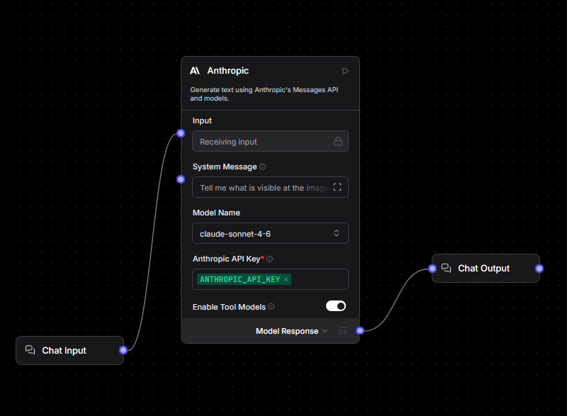
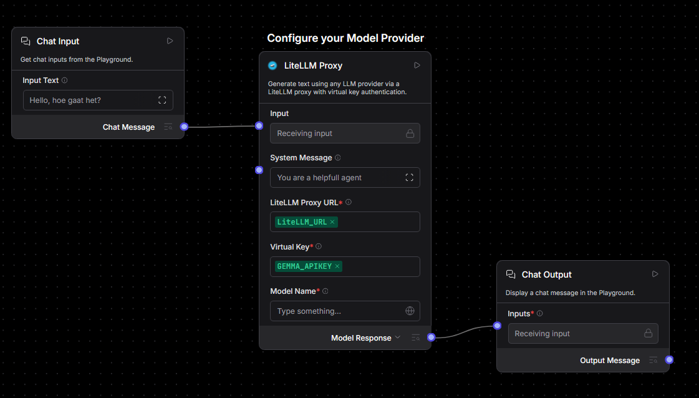
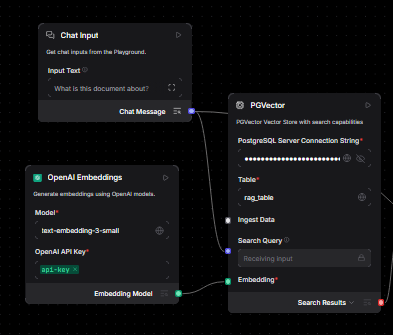

# Workshop Flows — Quick Start

These flows run on our own AI server using a custom **LiteLLM Proxy** component. Whatever flow you import, the setup is the same idea:

> **Plug your pre-seeded variables into the matching fields.** You don't type API keys or connection strings — they're already in your account.

## Before you start

- Import a flow: drag its JSON into the panel on [flow.paip.nl](https://flow.paip.nl).
- Your account already has the variables below loaded. In a field, click the **variable icon** (🌐) and pick the one you need.

A basic flow is just an input, a component, and an output wired together:

## Available flows and components

| File | Type | What it does |
|---|---|---|
| `template-flows/Starter.json` | Flow | Simple chat: Chat Input → LiteLLM Proxy → Chat Output |
| `template-flows/RAG.json` | Flow | Full RAG: load a file into a vector database, then answer questions from it |
| `template-components/gemma4.json` | Component | LiteLLM Proxy — routes requests to any LLM via a proxy with virtual key authentication |

## The variables you'll use

| Variable | What it is | Where it goes |
|---|---|---|
| `APIKEY` | API key for our AI LLM + embedding server | **Every** `OpenAI API Key` field (LLM and Embeddings) |
| `kimi-k2.6` / `gpt-5.3-codex` | LLM model name (pick one) | **LiteLLM Proxy** → `Model Name` |
| `Text-embedding-3-small` | Embedding model name | **OpenAI Embeddings** → `Model` |
| `DATABASE` | PostgreSQL + pgvector connection string | **PGVector** → `PostgreSQL Server Connection String` |

> Only the RAG flow needs `DATABASE` and `Text-embedding-3-small`. The Starter flow only needs `APIKEY` and a model name.

## The rule for wiring any flow

No matter which components a flow has, fill the fields the same way:

| Field (on any component) | What to put |
|---|---|
| `OpenAI API Key` | `APIKEY` |
| `Model Name` (LLM) | `kimi-k2.6` or `gpt-5.3-codex` |
| `Model` (Embeddings) | `Text-embedding-3-small` |
| `PostgreSQL Server Connection String` | `DATABASE` |
| `Temperature` | `0`–`1` — lower = more factual, higher = more creative |
| `System Message` | *(optional)* instructions for tone/role |
| `Template` (Prompt) | Keep the `{variables}` in `{curly braces}` — they're filled automatically |

Here the same fields are filled across several chained LLM components — `api-key` in every `OpenAI API Key` field, `gpt-5.3-codex` as the model, and Temperature set per component:

Standard Langflow components (Chat Input/Output, Split Text, If-Else, Parser, etc.) need no credentials — just connect them and set their own options.

Then open the **Playground** (top right) to run the flow.

## RAG flow

The RAG flow runs in two parts and **must be run in order**:

1. **Load Data** — reads a file, splits it into chunks, embeds them, and stores them in your database. Upload your file in **Read File**, then click **Run** on the **PGVector** component.

   > **Maximum file size: 1 MB.**

   

2. **Retriever** — answers questions from the stored data via the Playground.

For these to work:

- Use the **same embedding model** (`Text-embedding-3-small`) in both parts.
- Use the **same `Table` name** (e.g. `rag_table`) in both PGVector components.
- Point both at the same `DATABASE`.

## Tips

- **API key field empty?** Almost every error is a missing `APIKEY` — check each LLM and Embeddings component.
- **RAG returns nothing?** Run the Load Data part first, and confirm both parts share the same `DATABASE`, table name, and embedding model.
- **Build your own components.** Click the **Code** button (`</>`) on any component to open its Python source and edit the logic to give it custom behavior. You can also paste that code into an LLM (or ask one) to help you modify or create components from scratch.
